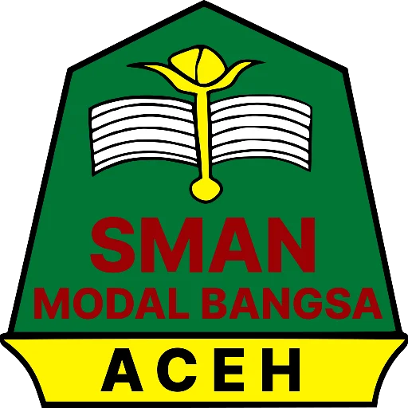

<div align="center">



# 🌸 TemanSulung

### *Teman Pendamping Anak Sulung Perempuan*

> Aplikasi interaktif berbasis **Model RISE** (*Resilience Intervention for Supporting Eldest*) yang dikembangkan sebagai bagian dari proposal riset **OPSI SMAN Modal Bangsa Aceh** untuk mendampingi siswi anak sulung perempuan yang mengalami *Eldest Daughter Syndrome*.

---

[](https://www.typescriptlang.org/)
[](https://reactjs.org/)
[](https://vitejs.dev/)
[](https://tailwindcss.com/)
[](https://openrouter.ai/)

</div>

---

## 📖 Tentang Aplikasi

**TemanSulung** adalah aplikasi web edukatif & interaktif yang dirancang khusus untuk siswi anak sulung perempuan (*eldest daughter*) di SMAN Modal Bangsa Aceh. Aplikasi ini merupakan implementasi digital dari **Proposal Riset OPSI** (*Olimpiade Penelitian Siswa Indonesia*) yang menggabungkan:

- 🧠 **Skrining Resiliensi Akademik** berbasis instrumen *Martin & Marsh (2006)*
- 💬 **Konseling AI "Si Jeumpa"** yang responsif terhadap konteks *Eldest Daughter Syndrome*
- 📚 **4 Modul Intervensi RISE** yang praktis dan berbasis bukti
- 📌 **Papan Catatan Padlet** untuk merekam perjalanan emosional

---

## ✨ Fitur Unggulan

| Fitur | Deskripsi |
|-------|-----------|
| 🩺 **Cek Tes Resiliensi** | Skrining 8 pertanyaan berdasarkan 4 dimensi Martin & Marsh: Confidence, Control, Composure, Commitment |
| 🤖 **Si Jeumpa AI** | Chatbot AI hangat berbasis Gemini Flash via OpenRouter, konteks OPSI SMAN Modal Bangsa |
| 📚 **Modul RISE** | 4 pilar intervensi: Psikoedukasi, Regulasi Emosi CBT, Dukungan BK, Belajar Adaptif |
| 📌 **Catatan Padlet** | Papan sticky note visual untuk histori tes & jurnal curhatan AI |
| 👤 **Multi-Profil** | Sistem profil pengguna tanpa login — setiap profil punya histori tersendiri |
| 💾 **Penyimpanan Lokal** | Semua data tersimpan privat di perangkat melalui `localStorage` |
| 🌸 **Doodle Background** | Ornamen SVG Bungong Jeumpa khas Aceh yang estetik |

---

## 🔬 Landasan Ilmiah

Aplikasi ini didasarkan pada:

```
📌 Eldest Daughter Syndrome (EDS)
   └─ Time Strain (kelelahan waktu)
   └─ Role Burden (tuntutan perfeksionisme)
   └─ Role Guilt (rasa bersalah saat istirahat)

📌 Model Resiliensi Akademik (Martin & Marsh, 2006)
   ├─ Confidence   → Keyakinan Diri Akademik
   ├─ Control      → Kendali Waktu & Tugas
   ├─ Composure    → Ketenangan Emosi / Stres
   └─ Commitment   → Ketekunan & Kegigihan

📌 4 Pilar Intervensi Model RISE
   ├─ Pilar 1: Psikoedukasi Batasan Sehat
   ├─ Pilar 2: Regulasi Emosi CBT & Mindfulness
   ├─ Pilar 3: Dukungan BK & Peer Group
   └─ Pilar 4: Belajar Adaptif (Pomodoro & Top 2 Priorities)
```

---

## 🛠️ Tech Stack

- **Framework**: React 18 + TypeScript
- **Bundler**: Vite 6
- **Styling**: TailwindCSS v4 + Custom Vanilla CSS
- **AI**: OpenRouter API → `google/gemini-2.5-flash`
- **State/Storage**: React Hooks + Browser `localStorage`
- **Icons**: Custom SVG Icon System (`CustomIcons.tsx`)
- **Font**: Plus Jakarta Sans (Google Fonts)

---

## 🚀 Cara Menjalankan Lokal

### 1. Clone repository

```bash
git clone https://github.com/faruqeclypst/TemanSulung.git
cd TemanSulung
```

### 2. Install dependencies

```bash
npm install
```

### 3. Buat file `.env`

Buat file `.env` di root project dan tambahkan API key OpenRouter kamu:

```env
VITE_OPENROUTER_API_KEY=sk-or-v1-xxxxxxxxxxxxxxxxxxxxxxxxxxxxxxxx
```

> 🔑 Dapatkan API Key gratis di [https://openrouter.ai](https://openrouter.ai)

### 4. Jalankan dev server

```bash
npm run dev
```

Buka browser di `http://localhost:5173`

### 5. Build produksi

```bash
npm run build
```

---

## 📁 Struktur Proyek

```
TemanSulung/
├── public/
│   └── assets/              # Gambar mascot, logo, hero
├── src/
│   ├── components/
│   │   ├── Navbar.tsx        # Navigasi + badge profil
│   │   ├── LandingPage.tsx   # Halaman beranda
│   │   ├── AssessmentForm.tsx     # Form tes 3 langkah
│   │   ├── AssessmentResult.tsx   # Hasil & analisis tes
│   │   ├── AICounselorModal.tsx   # Chat Si Jeumpa AI
│   │   ├── RiseModules.tsx        # 4 modul intervensi
│   │   ├── HistoryView.tsx        # Papan Padlet catatan
│   │   ├── AboutView.tsx          # Halaman tentang
│   │   ├── UserProfileBar.tsx     # Switcher profil
│   │   ├── BackgroundDoodles.tsx  # Ornamen SVG doodle
│   │   ├── CustomIcons.tsx        # SVG icon system
│   │   └── RiseLogoSvg.tsx        # Logo SVG aplikasi
│   ├── services/
│   │   ├── aiCounselor.ts    # OpenRouter API integration
│   │   └── storage.ts        # localStorage management
│   ├── types/
│   │   └── index.ts           # TypeScript interfaces
│   ├── App.tsx                # Root component + FAB
│   ├── main.tsx               # Entry point
│   └── index.css              # Global styles + doodle BG
├── .env                       # API key (JANGAN di-commit!)
├── .gitignore
├── index.html
├── package.json
├── tsconfig.json
└── vite.config.ts
```

---

## 👩‍🔬 Tim Peneliti & Pengembang

<table>
  <tr>
    <td align="center">
      <strong>Siti Endah Dinara</strong><br/>
      <sub>Tim Peneliti OPSI</sub><br/>
      <sub>SMAN Modal Bangsa Aceh</sub>
    </td>
    <td align="center">
      <strong>Zalfa Zahiya</strong><br/>
      <sub>Tim Peneliti OPSI</sub><br/>
      <sub>SMAN Modal Bangsa Aceh</sub>
    </td>
  </tr>
</table>

**Pembimbing Penelitian & Aplikasi**
> 🏫 SMAN Modal Bangsa Aceh — *Olimpiade Penelitian Siswa Indonesia (OPSI)*

---

## 🌺 Maskot: Si Jeumpa

**Si Jeumpa** adalah maskot AI TemanSulung — siswi berhijab yang hangat dan ramah, terinspirasi dari bunga *Bungong Jeumpa* khas Aceh yang melambangkan keindahan, ketahanan, dan keharuman identitas lokal Aceh.

Si Jeumpa menjawab curhatan pengguna menggunakan kerangka pengetahuan **OPSI SMAN Modal Bangsa** untuk memberikan saran yang tepat, hangat, dan berbasis bukti ilmiah.

---

## 📜 Lisensi

Proyek ini dikembangkan untuk keperluan **OPSI (Olimpiade Penelitian Siswa Indonesia)** SMAN Modal Bangsa Aceh.

---

<div align="center">

🌸 *"Kamu sudah berjuang luar biasa mengurus rumah sambil sekolah. Yuk kita jaga kesehatan mentalmu bersama Si Jeumpa!"* 🌸

**TemanSulung** — *Resiliensi untuk Anak Sulung Perempuan Indonesia*

</div>
